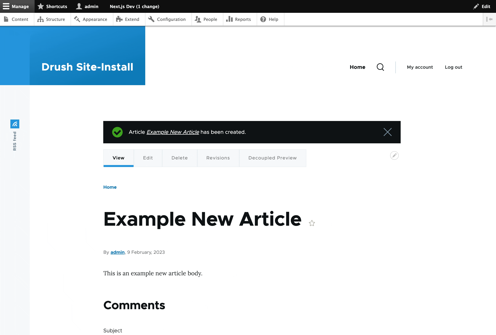

## What Are Build Hooks?

The [Build Hooks](https://www.drupal.org/project/build_hooks) module has the
capability to trigger builds in one or more front-end sites when any content
changes occur, such as creating, updating, or deleting.

## Installing the Build Hooks Module

If you are using the
[Decoupled Drupal Composer Managed](https://github.com/pantheon-systems/drupal-composer-managed)
starter template, the Build Hooks module will already be included as a composer
dependency. For other projects, run the following command to add the module as a
dependency:

```
composer require 'drupal/build_hooks:^3.3'
```

After adding the dependency it must be installed. This can be done either
through the Drupal admin dashboard or using
[drush pm-enable](https://drushcommands.com/drush-9x/pm/pm:enable/).

## Setting Up a Build Hook

### Trigger a Deployment Automatically When Content Changes

1. After generating a build hook on your build platform, go to
   **Configuration** >> **Build hooks** >> **Frontend environment**.
2. Click on the **Add Frontend environment** button.
3. Fill out the form with the required information including Label, URL,
   Deployment strategy (for this use-case, select **When content is updated**),
   Weight, and Build hook URL.
4. Save the form.

This will automatically trigger your build hook when content changes.

:::note

By default the module will only log changes for content entities. If you would
like to trigger build hooks based on other entity updates, go to
**Administration** >> **Configuration** >> **Build hooks** >> **Build Hooks
Settings** to configure other entities.

:::

### Trigger a Deployment Manually

It is also possible to create a build hook that can only be triggered manually.
This can be useful if you would like more control over the time of deployment or
if you would prefer to batch multiple content changes into a single deployment.

Follow the same steps as "Trigger a Deployment Automatically" to create a Build
Hook Frontend Environment but select **Deployment strategy** as **Manually
only**.



1. After a content is created/updated, go to
   `admin/build_hooks/deployments/<BUILD_HOOK_MACHINE_NAME>`.
2. Click on **Start a new deployment to the <BUILD_HOOK_NAME> environment**.
   Which will trigger the Build Hook on the frontend site.

:::note

The deployment strategy can also be set to Cron Job, which will trigger the
build hook automatically at a specified interval if Cron is configured on your
site.

:::
